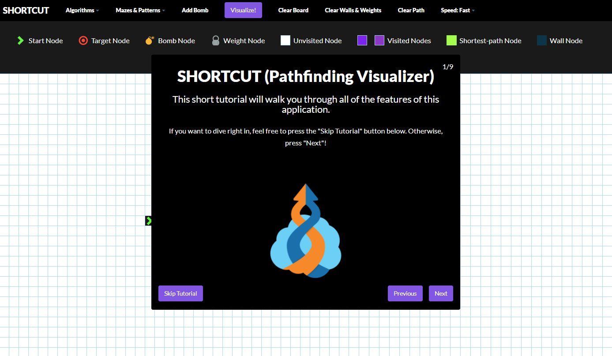
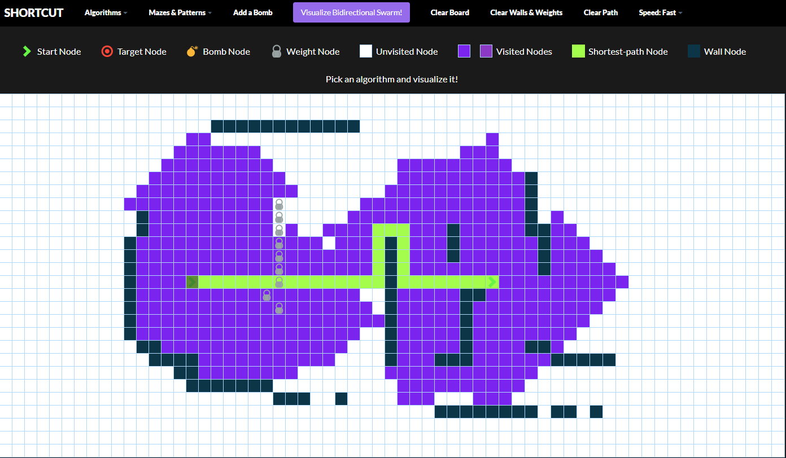

## SHORTCUT (Pathfinding Visualizer)

This project is inspired by **Clément Mihailescu's** Pathfinding Visualizer and this is a working replica of that project which includes over 8 different algorithms. This project is designed using Vanilla JavaScript.

## Link to the working site

https://itsjustmithun.github.io/Pathfinding-Visualizer-Vanilla/

## Video Demo

## Images

## Algorithms

This application uses following algorithms:

**Dijkstra's Algorithm** (weighted): the father of pathfinding algorithms; guarantees the shortest path

**A\* Search** (weighted): arguably the best pathfinding algorithm; uses heuristics to guarantee the shortest path much faster than Dijkstra's Algorithm

**Greedy Best-first Search** (weighted): a faster, more heuristic-heavy version of A\*; does not guarantee the shortest path

**Breath-first Search** (unweighted): a great algorithm; guarantees the shortest path

**Depth-first Search** (unweighted): a very bad algorithm for pathfinding; does not guarantee the shortest path

**Swarm Algorithm** (weighted): a mixture of Dijkstra's Algorithm and A\*; does not guarantee the shortest-path

**Convergent Swarm Algorithm** (weighted): the faster, more heuristic-heavy version of Swarm; does not guarantee the shortest path

**Bidirectional Swarm Algorithm** (weighted): Swarm from both sides; does not guarantee the shortest path
